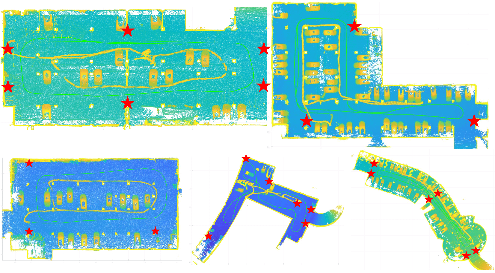
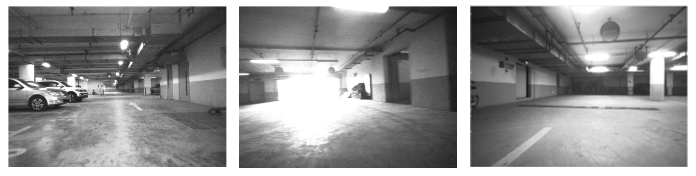

# TJ-UWB-MonoImage-Dataset: A UWB and monocular image Dataset for Autonomous Driving
The small car and sensor suite for data collection are shown in the figure below, including an UWB tag, a Realsense D455 camera, a 32-channel LiDAR, and a high-precision Xsens IMU.

 
<b>The vehicle and sensor suite for data collection.</b>

We have collected a large amount of data in five underground parking lots with different structures, whose LiDAR 3D reconstruction renderings are shown in the figure below. The red pentagrams mark the UWB anchor positions.

 
<b>LiDAR 3D reconstruction renderings of the five underground parking lots.</b>

All sequences can be divided into three groups: Multi-loop Driving, Single-loop Parking and Complete Test. All sequences in the Multiloop Driving group are collected in three laps around underground parking lots, which can be used to test the stability of the localization system over long periods of driving. All sequences in the Single-loop Parking group start from a certain parking space and circle the whole parking lot before finally reversing into the original space. This group simulates the autonomous valet parking conditions. The sequences in the Complete Test group fully simulated the entire process of a vehicle entering the underground parking lot
through a ramp, searching for a parking space, leaving the space, and finally leaving the parking lot through the ramp. This group can verify the adaptability of the localization system to up and down ramps.

Some sequences contain visual localization challenging conditions, such as overexposure, etc. Some of the captured images are shown in the figure below.

 
<b>Monocular images of sequence A01.</b>

